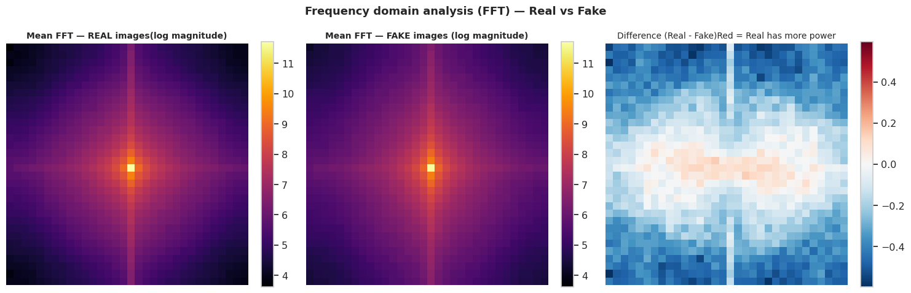
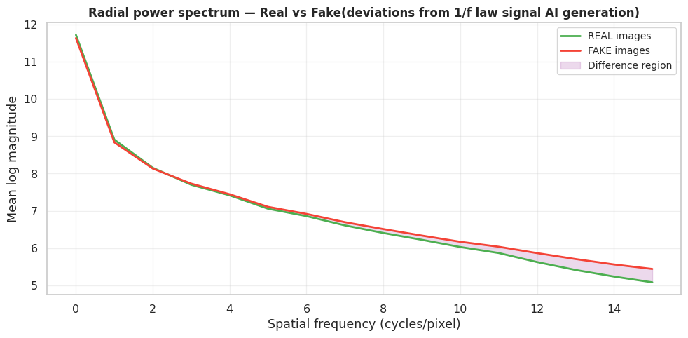
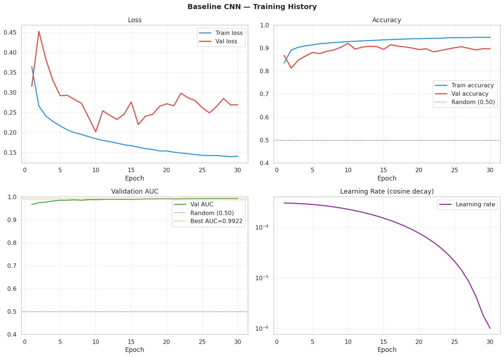
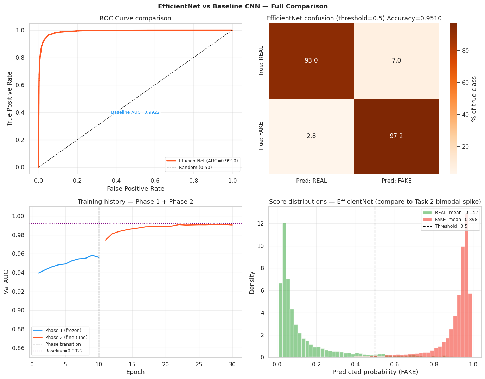
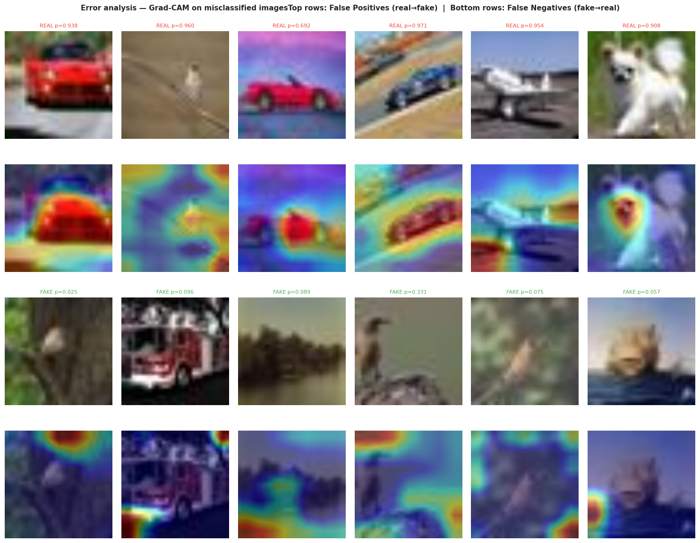
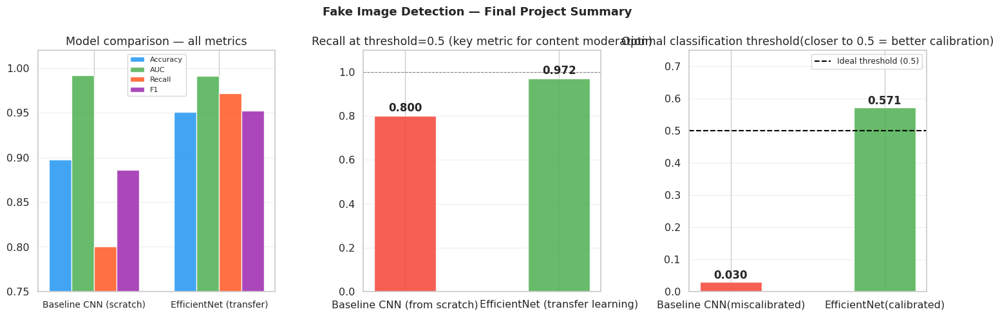

# Fake Image Detection Project — Forensic Deep Learning Pipeline

This repository contains an end-to-end computer vision pipeline for detecting AI-generated images using forensic analysis, transfer learning (EfficientNetB0), and Grad-CAM explainability. The project is designed for high-accuracy content moderation, specifically distinguishing between authentic camera photographs and Stable Diffusion generated media.

## Project Documentation

Detailed analytical documentation is available in the following reports:

- [Comprehensive Insight Report](INSIGHT_REPORT.md) — A professional whitepaper detailing the methodology, forensic findings, and detailed result analysis.
- [Final Pipeline Results Report](FINAL_PIPELINE_RESULTS_REPORT.md) — A sequential compilation of all 47 code cell outputs and extracted visualizations from Tasks 1-4.
- [Model Card](outputs/model_card.txt) — Formal documentation of model performance, intended use, limitations, and ethical considerations.

---

## Executive Summary

AI-generated images pose a significant challenge to information integrity. This project demonstrates that while visual inspection is insufficient at low resolutions (32x32), forensic signals in the frequency and texture domains provide a robust basis for detection.

By leveraging EfficientNetB0 transfer learning and a two-phase training strategy, the pipeline achieved a recall of 97.2% on AI-generated images, a 17.1 percentage point improvement over a scratch-trained baseline.

### Performance Comparison

| Metric | Baseline CNN (Scratch) | EfficientNet (Transfer) | Improvement |
|---|---|---|---|
| Accuracy | 0.8973 | 0.9510 | +5.37 percentage points |
| Recall | 0.8004 | 0.9716 | +17.12 percentage points |
| F1 Score | 0.8863 | 0.9520 | +0.0657 |
| Optimal Threshold | 0.030 | 0.5714 | Improved Calibration |

---

## Forensic Insights (Task 1)

The pipeline identifies AI-generated images by detecting artifacts in the frequency domain that are invisible to the human eye.

### Frequency Analysis (FFT)

The most discriminative feature is the radial power spectrum divergence at mid-high frequencies.


*Figure 1: FFT Magnitude Spectra comparing Real (left) and Fake (center) frequency content.*


*Figure 2: Radial power spectrum curves showing significant divergence in higher frequency bands for AI-generated images.*

---

## Model Development (Tasks 2 & 3)

The project follows a rigorous progression from a scratch-trained baseline to an advanced transfer learning architecture.

### Training Dynamics

Transfer learning effectively addressed the overfit gap and recall limitations observed in the baseline model.


*Figure 3: Training curves for the baseline CNN showing moderate overfitting and plateauing performance.*


*Figure 4: Head-to-head comparison of EfficientNet vs. Baseline, showcasing the dramatic improvement in recall and probability calibration.*

---

## Explainability and Diagnostics (Task 4)

Grad-CAM (Gradient-weighted Class Activation Mapping) is used to validate that the model focuses on forensic texture cues rather than semantic content.

### Grad-CAM Interpretability


*Figure 5: Grad-CAM heatmaps for error cases, demonstrating how the model targets texture boundaries and surface irregularities.*


*Figure 6: Final project dashboard consolidating all key metrics and pipeline milestones.*

---

## Repository Structure

```
fake-image-detection/
├── notebooks/
│   ├── task1_eda_forensics.ipynb          # Forensic EDA (FFT, Noise, LBP)
│   ├── task2_baseline_cnn.ipynb           # Baseline CNN training
│   ├── task3_efficientnet.ipynb           # Transfer Learning (2-Phase)
│   └── task4_gradcam_modelcard.ipynb      # Explainability and Model Card
├── images/                                # Processed forensic visualizations
├── outputs/                               # Model weights and result JSONs
├── deploy/                                # Streamlit inference application
├── INSIGHT_REPORT.md                      # Comprehensive project whitepaper
├── FINAL_PIPELINE_RESULTS_REPORT.md       # Consolidated code outputs
└── README.md                              # Project overview
```

---

## Setup and Usage

### Requirements
- Python 3.10+
- PyTorch 2.x
- NVIDIA GPU (Recommended for training)

### Installation
```bash
pip install -r requirements.txt
```

### Local Inference
To run the Streamlit web application for real-time image testing:
```bash
cd deploy
streamlit run app.py
```

---

## Key Learnings

1. Forensic signals (FFT, LBP) are more reliable than semantic content for detecting generative AI artifacts.
2. Transfer learning with pretrained texture detectors is essential for achieving high recall in forensics.
3. Model evaluation must prioritize recall and calibration over simple accuracy or AUC for content moderation.
4. Grad-CAM provides necessary validation that models are not "cheating" by learning irrelevant dataset biases.

---

## License
MIT License. See [LICENSE](LICENSE) for details.

*Project completed as part of the 10 Academy Fake Image Detection program, April 2026. Model trained on Kaggle Tesla T4 GPU.*
